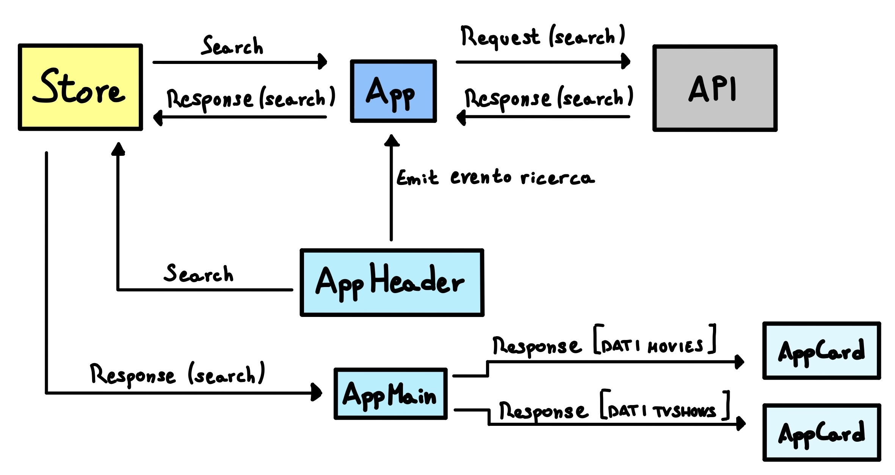

# Vue 3 + Vite Boolflix

1. Digito il nome del film/serie, clicco su 'cerca'
1.1 Il nome del film/serie e' inviato allo Store
1.2 L'evento di ricerca manda un messaggio ad App
2. App ottiene la stringa da cercare nello store
3. App manda una richiesta la cui queri e' la stringa da cercare
4. L'API restituisce la risposta relativa alla richiesta, che e' salvata in Store
5. AppMain richiede i dati della risposta allo Store
6. AppMain passa ad AppCard i dati relativi ai film o alle serie